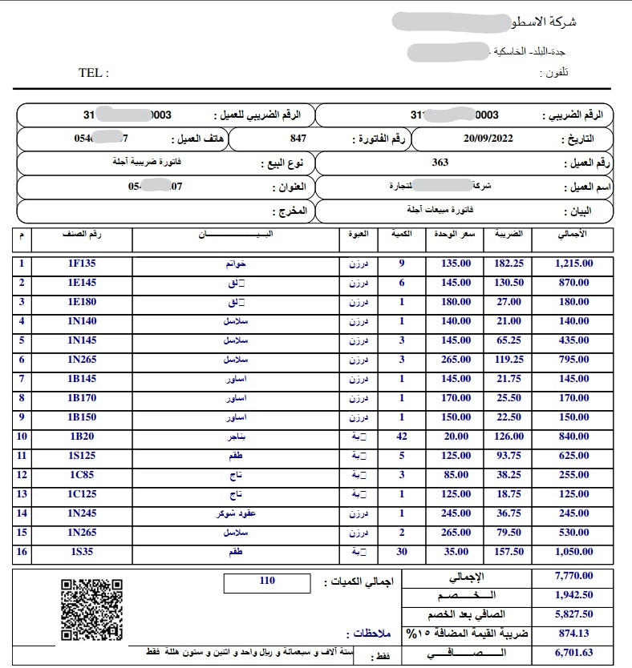

# GeeSuthSoft.ToolKit.Pdf
Extractor PDF Invoice Details @ .NET6
###### You can use it to extractor the invoice details to make it easy for user to insert the invoice to system


## Example :

### PDF file 


### Extractor Result Json :
```json
{
   "InvoiceCode":null,
   "InvoiceDate":"20/09/2022",
   "ItemsCount":16,
   "ItemsQty":110.0,
   "InvoiceNote":null,
   "InvoiceVatNo":"311380947100003",
   "InvoiceTotal":7770.00,
   "InvoiceTotalVat":1165.50,
   "Items":[
      {
         "Sn":1,
         "ItemCode":"1F135",
         "ItemName":null,
         "UnitName":null,
         "Qty":9.0,
         "UnitPrice":135.00,
         "UnitDiscount":null,
         "UnitVatAmount":182.25,
         "UnitTotal":1215.00
      },
      {
         "Sn":2,
         "ItemCode":"1E145",
         "ItemName":null,
         "UnitName":null,
         "Qty":6.0,
         "UnitPrice":145.00,
         "UnitDiscount":null,
         "UnitVatAmount":130.50,
         "UnitTotal":870.00
      },
      {
         "Sn":3,
         "ItemCode":"1E180",
         "ItemName":null,
         "UnitName":null,
         "Qty":1.0,
         "UnitPrice":180.00,
         "UnitDiscount":null,
         "UnitVatAmount":27.00,
         "UnitTotal":180.00
      },
      {
         "Sn":4,
         "ItemCode":"1N140",
         "ItemName":null,
         "UnitName":null,
         "Qty":1.0,
         "UnitPrice":140.00,
         "UnitDiscount":null,
         "UnitVatAmount":21.00,
         "UnitTotal":140.00
      },
      {
         "Sn":5,
         "ItemCode":"1N145",
         "ItemName":null,
         "UnitName":null,
         "Qty":3.0,
         "UnitPrice":145.00,
         "UnitDiscount":null,
         "UnitVatAmount":65.25,
         "UnitTotal":435.00
      },
      {
         "Sn":6,
         "ItemCode":"1N265",
         "ItemName":null,
         "UnitName":null,
         "Qty":3.0,
         "UnitPrice":265.00,
         "UnitDiscount":null,
         "UnitVatAmount":119.25,
         "UnitTotal":795.00
      },
      {
         "Sn":7,
         "ItemCode":"1B145",
         "ItemName":null,
         "UnitName":null,
         "Qty":1.0,
         "UnitPrice":145.00,
         "UnitDiscount":null,
         "UnitVatAmount":21.75,
         "UnitTotal":145.00
      },
      {
         "Sn":8,
         "ItemCode":"1B170",
         "ItemName":null,
         "UnitName":null,
         "Qty":1.0,
         "UnitPrice":170.00,
         "UnitDiscount":null,
         "UnitVatAmount":25.50,
         "UnitTotal":170.00
      },
      {
         "Sn":9,
         "ItemCode":"1B150",
         "ItemName":null,
         "UnitName":null,
         "Qty":1.0,
         "UnitPrice":150.00,
         "UnitDiscount":null,
         "UnitVatAmount":22.50,
         "UnitTotal":150.00
      },
      {
         "Sn":10,
         "ItemCode":"1B20",
         "ItemName":null,
         "UnitName":null,
         "Qty":42.0,
         "UnitPrice":20.00,
         "UnitDiscount":null,
         "UnitVatAmount":126.00,
         "UnitTotal":840.00
      },
      {
         "Sn":11,
         "ItemCode":"1S125",
         "ItemName":null,
         "UnitName":null,
         "Qty":5.0,
         "UnitPrice":125.00,
         "UnitDiscount":null,
         "UnitVatAmount":93.75,
         "UnitTotal":625.00
      },
      {
         "Sn":12,
         "ItemCode":"1C85",
         "ItemName":null,
         "UnitName":null,
         "Qty":3.0,
         "UnitPrice":85.00,
         "UnitDiscount":null,
         "UnitVatAmount":38.25,
         "UnitTotal":255.00
      },
      {
         "Sn":13,
         "ItemCode":"1C125",
         "ItemName":null,
         "UnitName":null,
         "Qty":1.0,
         "UnitPrice":125.00,
         "UnitDiscount":null,
         "UnitVatAmount":18.75,
         "UnitTotal":125.00
      },
      {
         "Sn":14,
         "ItemCode":"1N245",
         "ItemName":null,
         "UnitName":null,
         "Qty":1.0,
         "UnitPrice":245.00,
         "UnitDiscount":null,
         "UnitVatAmount":36.75,
         "UnitTotal":245.00
      },
      {
         "Sn":15,
         "ItemCode":"1N265",
         "ItemName":null,
         "UnitName":null,
         "Qty":2.0,
         "UnitPrice":265.00,
         "UnitDiscount":null,
         "UnitVatAmount":79.50,
         "UnitTotal":530.00
      },
      {
         "Sn":16,
         "ItemCode":"1S35",
         "ItemName":null,
         "UnitName":null,
         "Qty":30.0,
         "UnitPrice":35.00,
         "UnitDiscount":null,
         "UnitVatAmount":157.50,
         "UnitTotal":1050.00
      }
   ],
   "Person":{
      "PersonName":null,
      "PersonPhone":"0546714207",
      "PersonAddress":null,
      "PersonVatNo":"311380947100003"
   },
   "CreatorInfo":null
}
```


## Use :

##### DI :
```csharp
using GeeSuthSoft.ToolKit.Pdf.Extensions;
builder.Services.AddToolKitPdfRegisterService();
```


##### Method :

```csharp
async Task<string> ReadInvoiceStringAsync(string fileName);
async Task<Invoice> ReadInvoiceAsync(string filePath, RegexPatterns regexPatterns, List<string>? NotInterestedValues = null);
async Task<string> ReadInvoiceJsonAsync(Stream stream, RegexPatterns regexPatterns, List<string>? NotInterestedValues = null);
async Task<Invoice> ReadInvoiceAsync(string filePath, List<string>? NotInterested = null);
```


##### Custom Regex :

```csharp
new RegexPatterns()
            {
                RegexPatternForDates="",
                RegexPatternForItemsLine = "",
                RegexPatternForPersonPhoneNo ="" ,
                RegexPatternForPersonVatNo =""
            };
```


### Roadmap :

:heavy_check_mark: Init Library
:heavy_check_mark: Finish Text Analyze use ITextSharp
:heavy_check_mark: Can use custom regex to analyze invoice
:heavy_check_mark: Add default values to analyze
:heavy_minus_sign: Support right to left
:x: return creator Info of invoice
:heavy_check_mark: Create Xunit Test
:heavy_check_mark: Create web test ASP.NET Core
:x: Support analyze image invoice
:x: Improve Identify of invoice 

[comment]: <> (substr | :heavy_check_mark: |  :white_check_mark: | :heavy_check_mark:)

